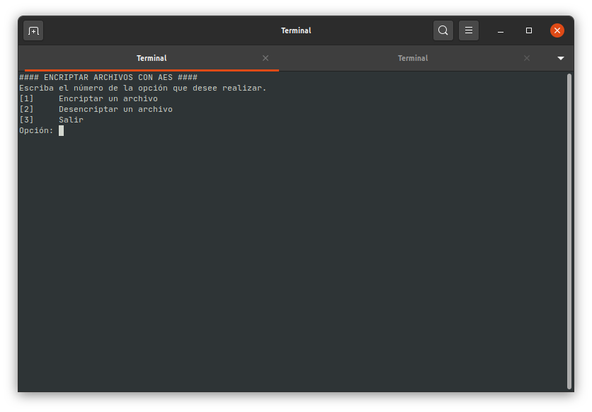
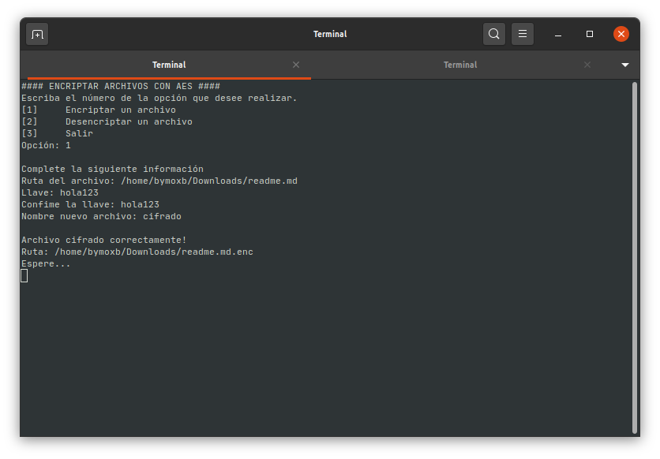
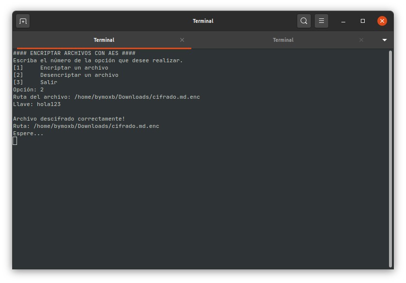

# Cifrando archivos con AES

Este es un sencillo programa en python para cifrar archivos con AES, utiliza el paquete [pycrypto](https://pypi.org/project/pycrypto/) para el cifrado.

Caracteristicas del cifrado:

* Llave de 16 bytes
* Vector de inicialización aleatorio de 16 bytes

## Capturas







## Instalación

```bash
# Instalar paquetes
pip install -r requirements.txt

# Ejecutar el programa
python main.py
```

## Recomendaciones

Usar [virtualenv](https://github.com/pypa/virtualenv) antes de instalar los paquetes.

Instalar la versión de [pycrypto](https://pypi.org/project/pycrypto/) especificada en el archivo `requirements.txt`.

Correr es programa en cualquier distribución de Linux, ya que [pycrypto](https://pypi.org/project/pycrypto/) existen problemas en la instalación en Windows.
